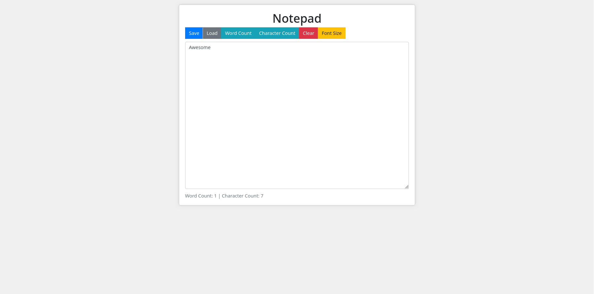
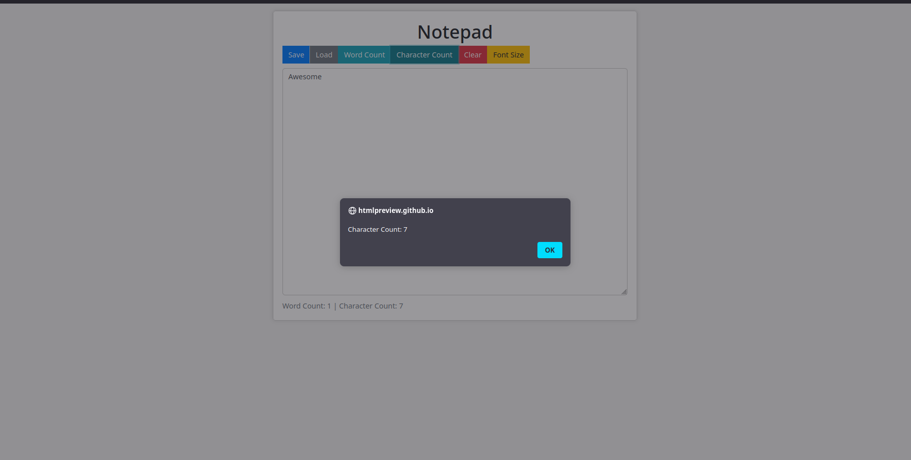

# Notepad

Made a nice looking notepad that has various functions such as font size, word count / character count, clear, load, and save.

## Try it here

[http://htmlpreview.github.io/?https://github.com/JubilantMarmot/HC-Notepadapp/blob/main/index.html](http://htmlpreview.github.io/?https://github.com/JubilantMarmot/HC-Notepadapp/blob/main/index.html)

## Screenshots

